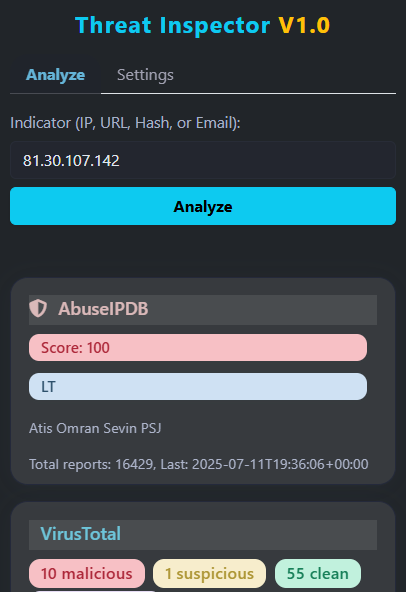
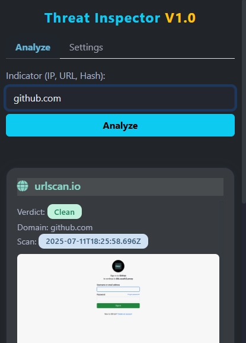
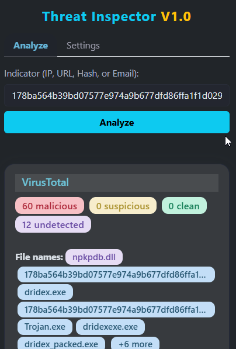
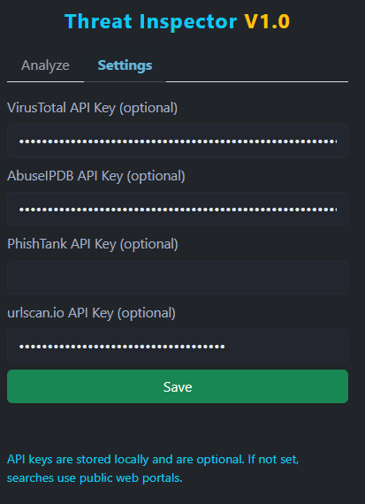

# Threat Inspector Chrome Extension
**Threat Inspector** is a Chrome extension for security analysts and SOC teams. It allows you to rapidly analyze Indicators of Compromise (IoCs) such as IP addresses, URLs, file hashes across multiple OSINT sources, all in a single, user-friendly interface.

---

## Features

- Analyze IP addresses, URLs, and file hashes.
- Integrated with multiple threat intelligence services:
  - VirusTotal (optional API key)
  - AbuseIPDB (optional API key)
  - urlscan.io (API key required)
  - Joe Sandbox (public hash analysis)
  - PhishTank (optional API key)
- Modern, responsive UI with dark mode and pastel color badges.
- Results displayed in professional, service-specific cards.
- Local storage of API keys with no data ever sent to third parties.
- All results sanitized to prevent XSS or code injection.

---

## Screenshots

### IP Address Analysis

### URL Analysis

### File Hash Analysis

### Settings Panel

---

## How It Works

1. Enter an indicator (IP, URL, hash) in the main field.
2. Click "Analyze".
3. The extension queries supported services and displays results in dedicated cards.
4. Use the "Settings" tab to securely store API keys and enable advanced lookups.

---

## Supported Services

| Service       | API Key Required | Free Tier          | Description                                        |
| ------------- | --------------- | ------------------ | -------------------------------------------------- |
| VirusTotal    | Optional        | Yes                | Multi-engine file, URL, and IP analysis            |
| AbuseIPDB     | Optional        | Yes                | Reputation for IP addresses                        |
| urlscan.io    | Yes             | Yes (daily quota)  | Visualizes URLs and domains                        |
| Joe Sandbox   | No              | Yes                | Public malware sandbox reports for hashes          |
| PhishTank     | Optional        | Yes                | Checks for phishing URLs                           |

---

## Installation

1. Download or clone this repository.
2. Open Chrome and navigate to `chrome://extensions`.
3. Enable "Developer mode" (top right).
4. Click "Load unpacked" and select the directory containing this extension.

---

## API Keys

- API keys are **optional** for most services, but required for higher limits or urlscan.io.
- Keys are stored **locally** and are never transmitted externally.
- To obtain free API keys, register at the following:
  - [VirusTotal](https://www.virustotal.com/gui/join-us)
  - [AbuseIPDB](https://www.abuseipdb.com/register)
  - [urlscan.io](https://urlscan.io/user/api/)
  - [PhishTank](https://www.phishtank.com/developer_info.php)

---

## Security & Privacy

- All network requests are sent directly from your browser.
- No user data or search history is transmitted or stored by this extension.
- All HTML is sanitized to prevent XSS and code injection.

---

## Development

- Built with Bootstrap 5 and jQuery (bundled locally).
- Modular JavaScript, easy to extend and maintain.

---

## Contributing

Contributions, bug reports, and feature requests are welcome.  
Please open an issue or submit a pull request.

---

## License

This project is licensed under the MIT License.

---

## Acknowledgments

Some parts of this project, including documentation and code structure, were assisted by Claude AI.

